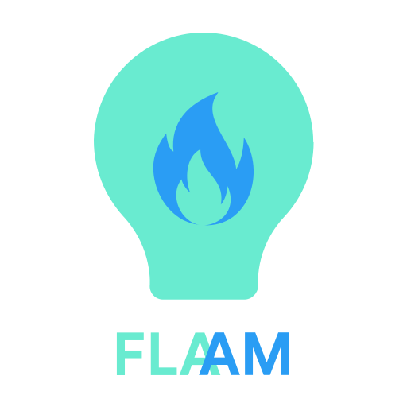

 

  

  

    A Platform for sharing Ideas.
     
     
    <a href="https://github.com/flaam-org/flaam-react">Website</a>
    ·
    <a href="https://github.com/flaam-org/flaam-android">Android App</a>
    ·
    <a href="https://github.com/flaam-org/flaam-api">Api</a>
  

#

### Introduction

Flaam is a platform where ideators can post ideas to find developers who can actually implement it and see the best implementation of their idea and for developers it is a platform where they can find inspiration and solve the problems that people are actually facing. All ideas and projects will be rated by the community and the poster will receive points for their contributions. Flaam can also be used as an alternative to hackathons, where developers can solve real world problems and get feedback from the community.

#### The working will be as given below -
- User creates an account.
- If he has a idea, he can post, others will see the post in their feed.
- If someone finds the idea interesting he can start implementing it by clicking a button and adding it to his ongoing implementations.
- After that he will be needed to add the GitHub repository link where the idea is implemented.
- The developer can track his progress by ticking the tasks he has completed (tasks checkboxes gets added when the user choose to implement the idea).
- Other users would also be able to see the developer's implementation, can suggest his changes or rate his work. 
- In this way, we would get number of solutions for a given idea or problem statement, also we will get the best way it can be solved as the best implementation will be sorted to the first by the rating system.

### Objectives
- To provide developers (especially newbies) with inspiration for projects they can work on.
- To find the ways in which a particular idea can be implemented and select the best one based on a rating system
- To promote open source as every implementation of a idea will be a open source GitHub repository.
- The project will give a platform to submit ideas (even to non technical people).

### Tech Stack

#### Database
- *type* 
    - **Relational**
- *database* 
    - **PostgreSQL**

#### Backend
- *language*
    - **Python**
- *framework*
    - **Django-rest-framework**
- *libraries*
    - **Django**: Web framework
    - **Django-rest-framework**: REST toolkit for Django
    - **Django-rest-framework-simplejwt**: Authentication provider for Django REST framework
    - **gunicorn**: Web server gateway interface
    - **psycopg2**: Database engine
    - **drf_yasg**: API documentation tool
    - **debug_toolbar**: Debugging tool
    - **black**: Code formatter

#### Frontend
- **Website**
    - *language* 
        - **JavaScript**
    - *framework* 
        - **React**: create interactive UI
        - **Tailwindcss**: CSS framework for styling
    - *libraries*
        - **redux**: A Predictable State Container for JS Apps
        - **redux-toolkit**: toolset for efficient Redux development
        - **formik**: track form state
        - **yup**: form validation
- **App**
    - *language* 
        - **Kotlin**
    - *platform*
        - **Android**
    - *Architecture*
        - **MVVM**
    - *dependencies*
        - **Dagger-Hilt** : A lightweight dependency injection tool.
        - **Retrofit** :  A type-safe REST client for Android.
        - **Coroutines** :  Multi-threading dependency that  lets Asynchronous code run in synchronous way.
        - **Okhttp3**:  for http requests.
        - **moshi**:  JSON-kotlin parsing tool.
        - **Glide**:  Image Processing Library.
        - **Jetpack Datastore**: Local Database
        - **navigation components**: To manage in app navigation, provides type safety argument transfer support.

### Future Scopes
- Moderation
- Use machine learning to generate feed of the user based on their favorite tags, previously implemented ideas, saved ideas and his other activities on the platform.
- Creating a portal for hiring

### Limitation
- The success of this project is highly dependent on number of users using this platform, large user-base is required for the project to be successful.
